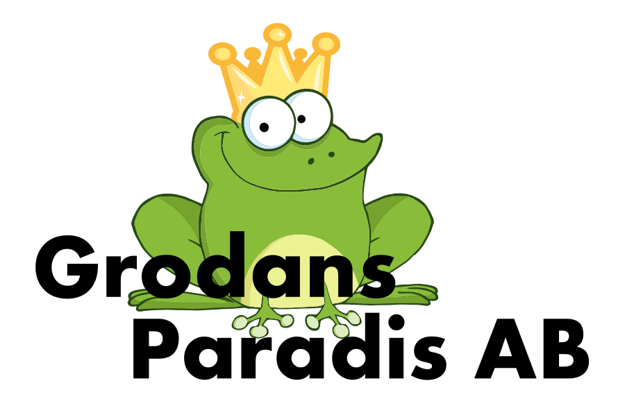

## Manual for the Frankfurt RS-232 module

**Document version:** ${/var/document-version} - ${/var/creation-time}
[HISTORY](./history.md)

Frankfurt RS-232 interfaces serial RS-232 to the CAN4VSCP bus and is powered from the CAN4VSCP bus. It can be used with a USB to serial adapter free of charge so it can also be connected to host computers that does not have a RS-232 port. The Frankfurt RS-232 is designed to be mounted on a DIN rail or screwed on to a wall or used in an other installed fashion. This module is as our other modules designed to do its work behind the scenes. It is a powerful and reliable workhorse that does not need to be in the centre of the spotlights to do the work it is designed for.

It is important to note that Frankfurt RS-232 is not a general CAN interface. The CAN speed of the device is fixed to 125 kbps and the serial speed is fixed at 115200 baud 8N1. This is because the Frankfurt RS-232 is made for the CAN4VSCP bus and VSCP and therefore does not need the variable speeds. If you need a general CAN adapter please look at Rusoku Technologies TouCan or other CAN <-> USB interfaces.

Frankfurt RS-232 have three working modes:

## Verbose mode

In this mode easy to remember and use text based commands can be issued to control the device. It is possible to find VSCP nodes on the connected CAN4VSCP bus, read and write registers and many other of the common functions needed to diagnose a CAN4VSCP system. The mode is created for users that need to check up on a CAN4VSCP network and get diagnostic information etc. It is possible to go to this mode from any of the other modes at any time and therefore get the most out of each modes available functionality.

## CAN4VSCP mode

This mode uses the efficient and secure VSCP serial protocol to talk to a host computer. Drivers for Windows and Linux is readably available and it is a turn key solution to connect any CAN4VSCP bus to a host. The driver follows the CANAL standard so both the VSCP Daemon and the VSCP Works programs can be used.
SLCAN mode

The Swedish company Lawicel AB and Lars Wictorsson created a serial protocol for CAN adapters that since been a standard for such devices. The SLCAN mode of Frankfurt RS-232 support a limited set of commands from this standard so that the module can be connected to the Socketcan system available for Linux. Se the manual for the commands that are implemented. Also in this case the CAN speed is fixed at 125 kbps and the serial speed is fixed at 115200 kbps.

It is possible to have hundreds of Frankfurt RS-232 modules connected to a host computer where each in turn is connected to hundreds of nodes, thereby building very large and complex systems. Together with cards like Raspberry Pi, Beaglebone and others it is possible to have distributed control systems controlled over Ethernet and TCP/IP.

  * [Repository for the module](https://github.com/grodansparadis/can4vscp-frankfurt-rs232)
  * This manual is available [here](https://grodansparadis.github.io/can4vscp-frankfurt_rs232/#)
  * Latest schema for the module is available [here](https://github.com/grodansparadis/can4vscp-frankfurt-rs232/blob/master/images/schema_rev_B.png)
  * Latest firmware for the module is available [here](https://github.com/grodansparadis/can4vscp-frankfurt-rs232/releases/tag/v1.1.4)

## VSCP

VSCP is a free and open automation protocol for IoT and m2m devices. Visit [the VSCP site](https://www.vscp.org) for more information.

**VSCP is free.** Placed in the **public domain**. Free to use. Free to change. Free to do whatever you want to do with it. VSCP is not owned by anyone. VSCP will stay free and gratis forever.

The specification for the VSCP protocol is [here](https://docs.vscp.org) 

VSCP documentation for various parts can be found [here](https://docs.vscp.org/).

If you use VSCP please consider contributing resources or time to the project ([https://github.com/sponsors/grodansparadis](https://github.com/sponsors/grodansparadis)).

## Buy a module

Ready made modules can be bought from [Grodans Paradis AB](https://www.grodansparadis.com).

## Document license

This document is licensed under [Creative Commons BY 4.0](https://creativecommons.org/licenses/by/4.0/) and can be freely copied, redistributed, remixed, transformed, built upon as long as you give credits to the author.

[filename](./bottom-copyright.md ':include')
