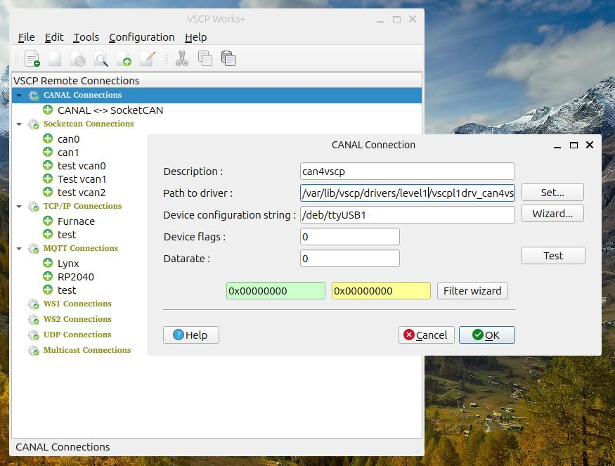

# Using with VSCP Works

All options for the driver is described
[here](https://github.com/grodansparadis/vscpl1drv-can4vscp)

Just add the driver to use it

## Description

Enter a description that have meaning to you

## Path

Set the full path to the driver file **vscpl1_can4vscpdrv.dll/so**

## Device Configuration String

The serial channel. Typically **COM1/COM2/COM3** on windows and **/dev/ttyS0** **/dev/ttyUSB0** etc on Unix.

## Device Flags
Leave at zero.

## Datarate
Leave at zero.

[filename](./bottom-copyright.md ':include')
